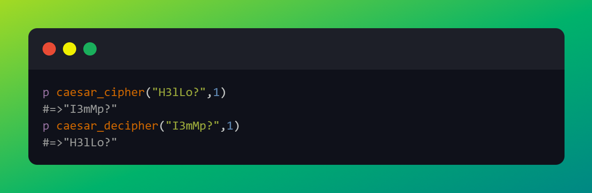
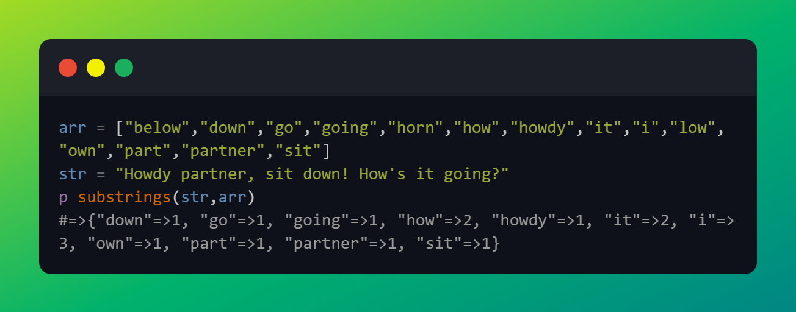
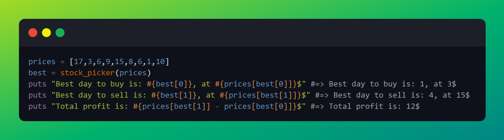
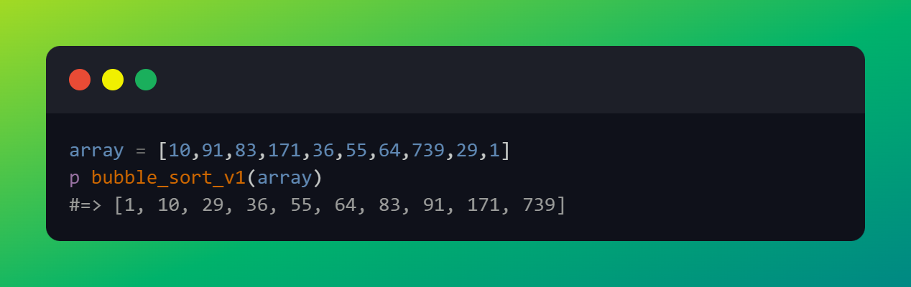
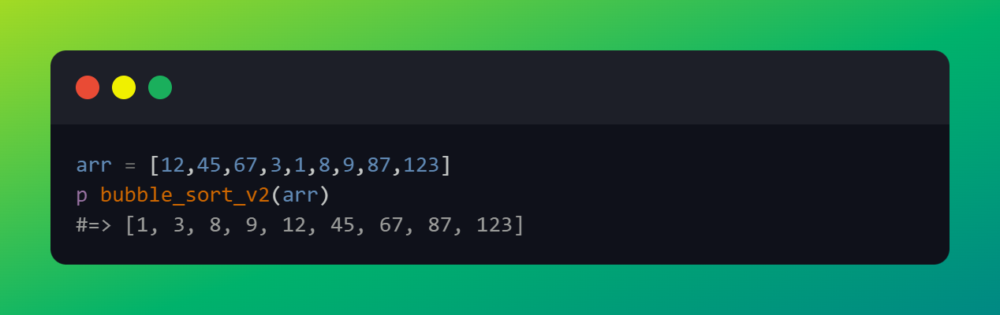

# The Odin Project - Ruby Projects
In this repository I'll push all the ruby scripts I will write as a solution to the projects in the Ruby course

<ol>
<li>
  <h3>Caesar cipher</h3>
  
This is the first project and it's an implementation of the Caesar cipher. Given a string and an integer(k) used as the key, it will output the string with the letter shifted to the right by <b><i>k</i></b> positions.

    
Below you can find two snippets of the input and the output. Both crypt and decrypt.

  
</li>
<li>
  <h3>Sub strings</h3>
  
In this second project, the object is to implement the method substring such that it receives a phrase and a dictionary(an array) and it'll 
  output an hash containing all the words of the dictionary that are included in the phrase. The hash also contains the number of time each word 
    is used in the phrase

  
Below ther's the snippet code with the method being called and it's output.

  
</li>
<li>
  <h3>Stock picker</h3>
  
In this project, the method I had to implement was about searching the best day to buy and sell a stock, given an array with the daily prices of a stock. One thing I had to to pay attention to is that before selling I should check if previously I've bought that stock.

  
Below ther's the snippet code with the method being called and it's output.

  
</li>
<li>
  <h3>Bubble sort V1</h3>
  
In this project there's a basic implementation of a bubble sort.  A bubble sort, is a sorting algorithm that compare two following items in an array, and if the second is bigger, it switches them. This first version executes more than necessary comparisons.

  
Below ther's the snippet code with the method being called and it's output.

  
</li>
<li>
  <h3>Bubble sort V2</h3>
  
In this project there's a basic implementation of a bubble sort.  A bubble sort, is a sorting algorithm that compare two following items in an array, and if the second is bigger, it switches them. This second version add a check so that the algorithm executes only comparisons when necessary.

  
Below ther's the snippet code with the method being called and it's output.

  
</li>
<li>
  <h3>Tic Tac Toe</h3>
  
In this project there's an implementation of the ame tic tac toe. It has no GUI, to play you have to digit the number of the row and the number of the column of the cell you wish to mark. All of the input and output is done trough the terminal.

  
Below ther's the snippet code with the class being created and the method play invocated. There is also commented a possible output of the console.

  
  
</li>
</ol>
