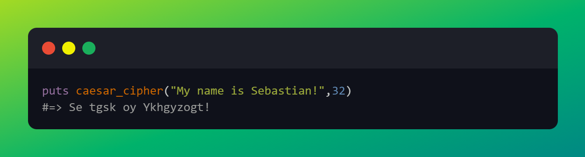

# The Odin Project - Ruby Projects
In this repository I'll push all the ruby scripts I will write as a solution to the projects in the Ruby course

<h3>Caesar cipher</h3>

This is the first project and it's an implementation of the Caesar cipher. Below you can find two snippets of the input and the output. Both snippets return the same ciphertext even if using two different keys because I've made it that it's a round key, so that key=6 is the same as key=32

and

